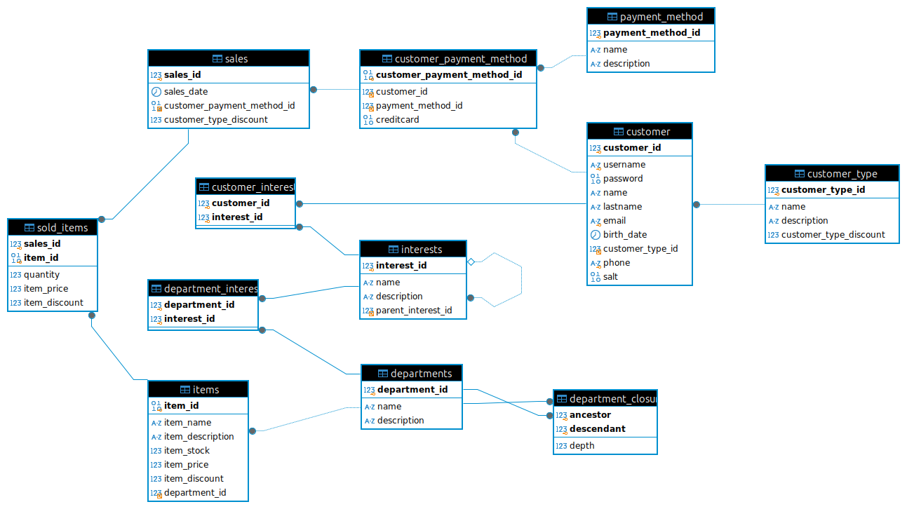

# CREACION DE BASE DE DATOS

##  "miChangarro" Tienda Departamental

## Entrega Final.

[Descripción del proyecto](final/md/descripcion.md).
 
[Documentación de los objetos](final/md/objetos.md).

El diagrama de la BD : 



## - Objetos creados en esta BD

Podrá encontrar la descripción de los objetos que se han creado en el archivo [Objetos](final/md/objetos.md). Aquí enumero.

	4 Funciones
	20 Procedimientos
	2 Triggers
	2 Vistas
	1 Script de python

## Procedimiento para probar los objetos:  

La Base de datos ha sido creada en mysql Workbench y respaldada con mysqldump  Ver 8.0.40 for Linux on x86_64 (MySQL Community Server - GPL).

Se han tenido problemas son "Definer = root" al ejecutarse en windows por lo que tenemos las siguientes opciones.

### Opción 1.

Usar [michangarro-lnx.sql](final/scripts/michangarro-lnx.sql) que se encuentra en  final/scripts/michangarro-lnx.sql.

	Ejecutar en Workbench:
	
	SET GLOBAL log_bin_trust_function_creators = 1;
	Restaurar: michangarro-lnx.sql
	SET GLOBAL log_bin_trust_function_creators = 0;

 ### Opción 2.
 
 Usar [michangarro.sql](final/scripts/michangarro.sql) que se encuentra en la carpeta final/scripts/michangarro.sql.
Se respaldo la base de datos con el comando siguiente:


```
sudo docker exec -i sqlcoder mysqldump -u root -p --databases michangarro --routines --triggers --default-character-set=utf8mb4 --hex-blob > ./michangarro.sql
sed -i '/DEFINER=/d' ./michangarro.sql
```

 - Restaturar michangarro.

### Opción 3.
Usar el archivo [michangarro-sin-datos.sql](final/scripts/michangarro-sin-datos.sql) el cual se encuentra en final/scripts/michangarro-sin-datos.sql

- Restaurar [michangarro-sin-datos.sql](final/scripts/michangarro-sin-datos.sql)
- Ejecutar el script [population.sql](final/scripts/population.sql) 
	

# Pruebas: 
Para facilitar las pruebas puede utilizar el archivo: [final/scripts/test.sql](final/scripts/test.sql)

# Limitaciones:
Por favor considere:

- La tabla **customer**; El campo password por ahora es almacenado con el algoritmo sha2 de mysql.
- La tabla **customer_payment_method**; Posee el campo `creditcard` que almacena información sensible y debe ser manejado de acuerdo con las políticas de seguridad. Por ahora sólo esta en binario con números de ejemplo.
- El Procedimiento  **sp_insert_sales_from_json** es sólo una aproximación; el finalizado debería obtener y modificar algunos campos de la base de datos.
- El procedimiento **sp_update_department** por ahora no actualiza la relación jerarquica de departamentos.
