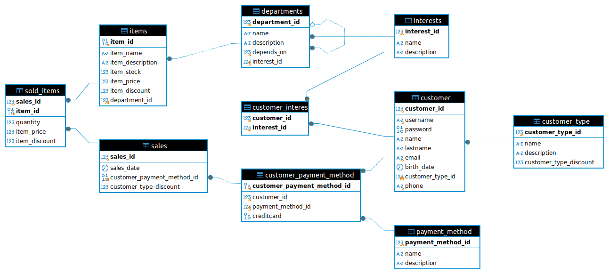

# CREACION DE Base de datos

## "miChangarro" TIENDA DEPARTAMENTAL.

### Problematica:
 "miChangarro" es una tienda departamental ficticia, que desea tener una base de datos robusta y eficiente. Esta base de datos debe permitir la gestión interna de su inventario de ventas; conocer las preferencias de los clientes ofreciendo múltiples opciones de compra, sin entorpecer las mismas y administrar los totales de ventas por cliente, departamento,mes, etc.
 
 Desglose de Problemas:
 1. Gestión de Clientes: Necesitamos una base de datos que permita registrar la información de los clientes, sus métodos de pago, preferencias y posibles descuentos por tipo de cliente.
 2. Gestión de Empleados: registran y actualizan el inventario, gestionan información de departamentos de tienda y en general actualizan la información del sistema.
 3. Seguridad en las transacciones: La base de datos debe permitirle al negocio poder dar detalles e informes sobre las ventas con datos en línea para toma de decisiones.

### Solución Propuesta:
 
 El diseño propuesto a continuación pretende cumplir con la escalabilidad y seguridad que definen los requerimientos. Esta base de datos permite tener control sobre los artículos del almacén, gestiona datos de clientes, empleado y proporciona informes sobre monto de transacciones de ventas. 
 
 Esta base de datos aborda principalmente lo siguiente:
- Almacén: 
	+ Nombre del Articulo
	+ Precio
	+ Cantidad de Artículos en almacén
	+ Descuento del producto 
	+ Departamento al que pertenece.
- Departamentos
	+ Nombre del departamento
	+ Subdepartamentos
	+ Descripciones de los mismos.
	
- Gestión de Clientes:
	+ Datos Generales
	+ ¿Que compran los Clientes?
	+ Tipos de clientes
	+ Descuentos por lealtad o tipo de cliente.
	+ Métodos de pago del cliente. (Esto gestionado por los empleados)
	
- Ventas: Información de las Ventas
	+ Artículos vendidos
	+ ¿Quien los compra?
	+ ¿Con que los compra?
	+ ¿Cuantos Artículos compra?
	+ ¿Que departamento vende más?

### Funcionalidades Clave

__Gestión de Clientes__: Almacena datos de clientes y sus preferencias, facilitando la aplicación de descuentos.

__Gestión de Empleados__: Controla el acceso a datos e información sobre inventarios y ventas.

__Ventas__: Registra las transacciones, permitiendo analizar el rendimiento por departamento y por cliente.

__Seguridad en Transacciones__: Registro detallado de cada venta, permitiendo auditorías y análisis en tiempo real.

En resumen esta base de datos mejorara la precisión, eficiencia, seguridad y capacidad de toma de decisiones en la gestión la tienda.
 
 ### Conclusión
 
Este diseño de base de datos es escalable y seguro, permitiendo que "miChangarro" gestione eficazmente sus operaciones diarias, realice un seguimiento de las preferencias de los clientes y genere informes útiles para la toma de decisiones.
 
## Documentación de las Tablas

### customer_type
- **Descripción**: Entidad `customer_type`, almacena los tipos de clientes disponibles; no pueden existir más de 65,535 tipos de clientes.
- **Notas:**
	- *customer_type_discount*: Almacena un posible porcentaje de descuento (por empleado, cliente frecuente, VIP, etc.).
- **Relaciones**: Ninguna.

| Column             | Type              | Constraints                                      |
|--------------------|-------------------|--------------------------------------------------|
| customer_type_id   | SMALLINT UNSIGNED  | NOT NULL, AUTO_INCREMENT, PRIMARY KEY           |
| name                | VARCHAR(100)      | NOT NULL                                        |
| description         | VARCHAR(255)      | NULL                                            |
| customer_type_discount | DECIMAL(5, 2)  | NOT NULL DEFAULT 0.00 CHECK (customer_type_discount >= 0 AND customer_type_discount <= 100) |

### payment_method
- **Descripción**: Entidad `payment_method`, almacena los diferentes métodos de pago disponibles.
- **Relaciones**: Ninguna.

| Column             | Type              | Constraints                                      |
|--------------------|-------------------|--------------------------------------------------|
| payment_method_id   | SMALLINT UNSIGNED  | NOT NULL, AUTO_INCREMENT, PRIMARY KEY          |
| name                | VARCHAR(100)      | NOT NULL                                        |
| description         | VARCHAR(255)      | NULL                                            |

### interests
- **Descripción**: Almacena información sobre los intereses de los clientes (Tecnología, Electrodomésticos, etc.).
- **Relaciones**: Ninguna.

| Column             | Type              | Constraints                                      |
|--------------------|-------------------|--------------------------------------------------|
| interest_id        | SMALLINT UNSIGNED  | NOT NULL, AUTO_INCREMENT, PRIMARY KEY           |
| name                | VARCHAR(100)      | NOT NULL                                        |
| description         | VARCHAR(255)      | NULL                                            |

### departments
- **Descripción**: Almacena los diferentes departamentos y subdepartamentos de la tienda; no puede haber más de 65,535 departamentos con subdepartamentos.
- **Relaciones**:
  - `interest_id` → `interests(interest_id)`
  - `depends_on` → `departments(department_id)` **-Selfjoin-**

| Column             | Type              | Constraints                                      |
|--------------------|-------------------|--------------------------------------------------|
| department_id      | SMALLINT UNSIGNED  | NOT NULL, AUTO_INCREMENT, PRIMARY KEY           |
| name                | VARCHAR(100)      | NOT NULL                                        |
| description         | VARCHAR(255)      | NULL                                            |
| depends_on          | SMALLINT UNSIGNED  | NULL                                           |
| interest_id         | SMALLINT UNSIGNED  | NOT NULL, FK a interests(interest_id)          |

### customer
- **Descripción**: Almacena la información de los clientes; debe existir la cuenta Anónima para cumplir con los pagos sin registro.

- **Notas:**
	- `password` (VARBINARY) manejar el password con hash.
- **Relaciones**:
  - `customer_type_id` → `customer_type(customer_type_id)`

| Column             | Type              | Constraints                                      |
|--------------------|-------------------|--------------------------------------------------|
| customer_id        | INT UNSIGNED      | NOT NULL AUTO_INCREMENT PRIMARY KEY              |
| username           | VARCHAR(150)      | NOT NULL UNIQUE                                  |
| password           | VARBINARY(255)    | NOT NULL                                         |
| name               | VARCHAR(100)      | NOT NULL                                         |
| lastname           | VARCHAR(100)      | NOT NULL                                         |
| email              | VARCHAR(150)      | NOT NULL UNIQUE                                  |
| birth_date         | DATE              | NOT NULL                                         |
| customer_type_id   | SMALLINT UNSIGNED | NOT NULL, FK a customer_type(customer_type_id)   |
| phone              | VARCHAR(15)       | NOT NULL UNIQUE                                  |

### customer_interests
- **Descripción**: Almacena la relación entre clientes e intereses.
- **Relaciones**:
  - `customer_id` → `customer(customer_id)`
  - `interest_id` → `interests(interest_id)`

| Column             | Type              | Constraints                                      |
|--------------------|-------------------|--------------------------------------------------|
| customer_id        | INT UNSIGNED       | NOT NULL                                        |
| interest_id        | SMALLINT UNSIGNED  | NOT NULL                                        |

### customer_payment_method
- **Descripción**: Almacena los métodos de pago de los clientes; 
    - **CreditCard**: Puede ser nulo ya que el método de pago puede carecer de ella.
- **Relaciones**:
  - `customer_id` → `customer(customer_id)`
  - `payment_method_id` → `payment_method(payment_method_id)`

| Column                     | Type              | Constraints                                      |
|----------------------------|-------------------|--------------------------------------------------|
| customer_payment_method_id  | BINARY(16)        | NOT NULL, PRIMARY KEY                           |
| customer_id                 | INT UNSIGNED      | NOT NULL                                        |
| payment_method_id           | SMALLINT UNSIGNED | NOT NULL                                        |
| creditcard                  | VARBINARY(255)    | NULL                                            |

### items
- **Descripción**: Almacena la información de los artículos disponibles.
- **Relaciones**:
  - `department_id` → `departments(department_id)`

| Column             | Type              | Constraints                                      |
|--------------------|-------------------|--------------------------------------------------|
| item_id            | BINARY(16)        | NOT NULL, PRIMARY KEY                            |
| item_name          | VARCHAR(100)      | NOT NULL                                         |
| item_description   | VARCHAR(255)      | NULL                                             |
| item_stock         | INT               | NOT NULL CHECK (item_stock >= 0)                 |
| item_price         | DECIMAL(10, 2)    | NOT NULL CHECK (item_price >= 0)                 |
| item_discount      | DECIMAL(5, 2)     | NOT NULL DEFAULT 0.00 CHECK (item_discount >= 0 AND item_discount <= 100) |
| department_id      | SMALLINT UNSIGNED  | NOT NULL, FK a departments(department_id)       |

### sales
- **Descripción**: Almacena información sobre las ventas.

	- sales_id: Indice con formato YYYYMMDDXXXXX por lo que sólo puede haber 99,999 ventas diarias hasta el 31 de diciembre del 9999.
	- `customer_type_discount`: Almacena el descuento de `customer_type`, ya que este puede variar respecto al tiempo de la venta.
- **Relaciones**:
  - `customer_payment_method_id` → `customer_payment_method(customer_payment_method_id)`

| Column                     | Type              | Constraints                                      |
|----------------------------|-------------------|--------------------------------------------------|
| sales_id                   | BIGINT UNSIGNED    | NOT NULL, PRIMARY KEY                           |
| sales_date                 | DATETIME           | DEFAULT CURRENT_TIMESTAMP                       |
| customer_payment_method_id   | BINARY(16)        | NOT NULL                                       |
| customer_type_discount     | DECIMAL(5, 2)     | NOT NULL DEFAULT 0.00 CHECK (customer_type_discount >= 0 AND customer_type_discount <= 100) |

### sold_items
- **Descripción**: Almacena los artículos vendidos en cada venta; note el campo precio y descuento en esta tabla que cubren la variación de precio y descuento por artículo en este modelo.
- **Relaciones**:
  - `sales_id` → `sales(sales_id)`
  - `item_id` → `items(item_id)`

| Column             | Type              | Constraints                                      |
|--------------------|-------------------|--------------------------------------------------|
| sales_id           | BIGINT UNSIGNED    | NOT NULL                                        |
| item_id            | BINARY(16)        | NOT NULL                                         |
| quantity           | INT               | NOT NULL CHECK (quantity > 0)                    | 
| item_price         | DECIMAL(10, 2)    | NOT NULL CHECK (item_price >= 0)                 |
| item_discount      | DECIMAL(5, 2)     | NOT NULL DEFAULT 0.00 CHECK (item_discount >= 0 AND item_discount <= 100) |

