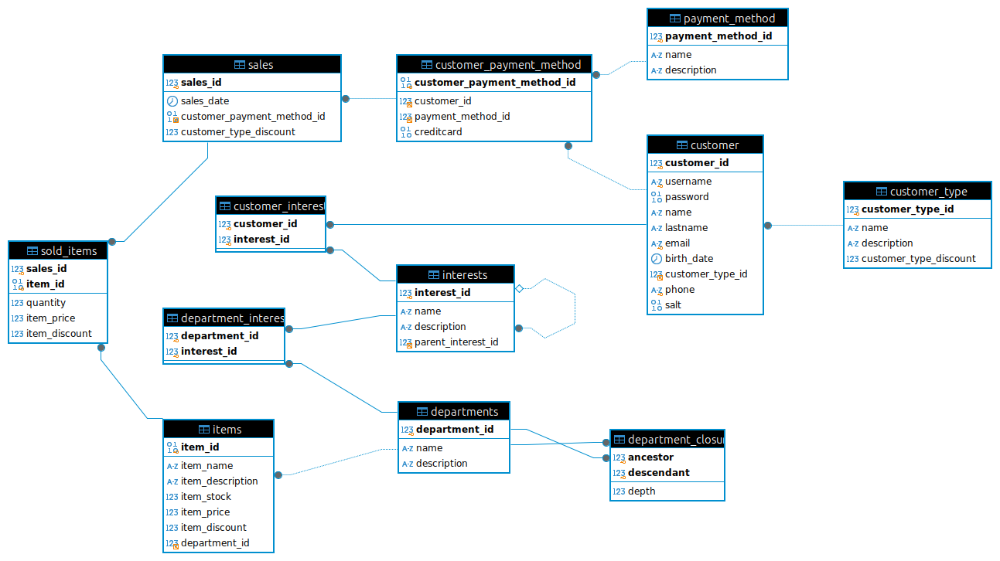

# CREACION DE BASE DE DATOS

##  "miChangarro" Tienda Departamental

## Entrega Final.

[Descripción del proyecto](md/descripcion.md).
 
[Documentación de los objetos](md/objetos.md).

El diagrama de la BD : 

## - Objetos creados en esta BD

Podrá encontrar la descripción de los objetos que se han creado en el archivo [Objetos](md/objetos.md). Aquí enumero.

	4 Funciones
	20 Procedimientos
	2 Triggers
	2 Vistas
	1 Script de python

## Procedimiento para probar los objetos:  
En la carpeta [/scripts](final/scripts/michangarro.sql) se encuentran los archivos siguientes: 

1. Cargar [michangarro.sql](scripts/michangarro.sql).
2. Ejecutar el script: [population.sql](scripts/population.sql), para cargar los datos.
3. Para facilitar las pruebas puede utilizar el archivo: [test.sql](scripts/test.sql)

# Limitaciones:
Por favor considere:

- La tabla **customer**; El campo password por ahora es almacenado con el algoritmo sha2 de mysql.
- La tabla **customer_payment_method**; Posee el campo `creditcard` que almacena información sensible y debe ser manejado de acuerdo con las políticas de seguridad. Por ahora sólo esta en binario con números de ejemplo.
- El Procedimiento  **sp_insert_sales_from_json** es sólo una aproximación.
- El procedimiento **sp_update_department** por ahora no actualiza la relación jerarquica de departamentos.
