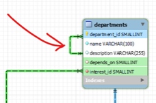
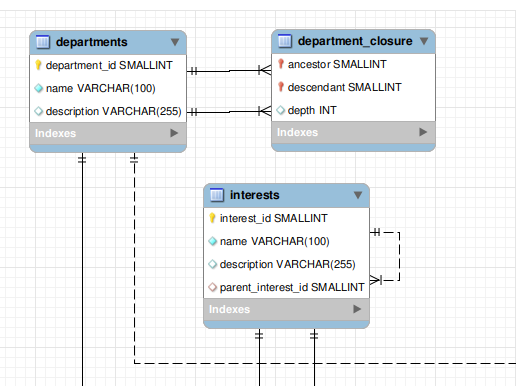

# CORRECCION DE Base de datos

## "miChangarro" TIENDA DEPARTAMENTAL. 

Regresar ala segunda entrega: [click aquí](./readme.md) 

| Imagen | Corregir |
| --------------- | -----------------|
|  |  Revizar la tabla departments ya que tiene una relación asi misma. |

El nuevo diagrama se ve así:
 
 
 
| **Modelo**          | **Adjacency List** | **Closure Table** |
|---------------------|-------------------|--------------------|
| **Tablas** | **interests** | **departments** |
| **Descripción**     | Forma sencilla y común de representar estructuras jerárquicas. Cada nodo tiene un campo que referencia a su padre, creando una jerarquía. | Utiliza una tabla adicional para almacenar todas las relaciones entre nodos, incluyendo todas las rutas posibles entre un nodo y sus ancestros y descendientes. |
| **Ventajas**        | - **Simplicidad**: Fácil de entender e implementar; refleja de manera natural la jerarquía. | - **Consultas Rápidas**: Permite obtener relaciones jerárquicas de manera eficiente, incluyendo búsquedas ascendentes y descendentes. |
|                     |                   | - **Flexibilidad**: Permite consultas complejas sin necesidad de múltiples JOINs. |
| **Desventajas**     | - **Consultas Complejas**: Obtener todos los descendientes puede requerir consultas recursivas o múltiples JOIN, lo que puede ser ineficiente. | - **Espacio Requerido**: Mayor uso de almacenamiento y puede complicar operaciones de inserción y eliminación. |
|                     | - **Limitaciones en Profundidad**: Consultas recursivas pueden ser difíciles de manejar si la jerarquía es muy profunda. | - **Complejidad en Mantenimiento**: Necesita mantener la tabla adicional, lo que puede aumentar la complejidad de las operaciones. |

Ambos modelos funcionan para Administrar gerarquías. Usaremos el Modelo Adjacency List (**Lista de Adyacencia**), para la tabla **interests**, ya que en este escenarío son pocos intereses. 
 	
Explico la restricción de la tabla intereses (**interests**):

	- La restricción : CONSTRAINT `fk_parent_interest` FOREIGN KEY (`parent_interest_id`) REFERENCES `interests` (`interest_id`) ON DELETE CASCADE 
	

### FOREIGN KEY (parent_interest_id):

Se define parent_interest_id como clave foranea de la tabla interest (la misma tabla) y así asegurar que parent_interest_id solo tiene valores de interest_id.

 ### Foreign Key Constraints en la Tabla `department_closure`

### 1. `department_closure_ibfk_1` FOREIGN KEY (`ancestor`) REFERENCES `departments` (`department_id`)

- **Descripción**: Este constraint establece que la columna `ancestor` en la tabla `department_closure` debe contener valores que existen en la columna `department_id` de la tabla `departments`.
- **Función**: 
  - **Integridad Referencial**: Asegura que cada `ancestor` que se inserte en `department_closure` corresponde a un `department_id` válido en `departments`. Si intentas insertar un valor en `ancestor` que no existe en `departments`, la base de datos rechazará la operación.
  - **Relación Jerárquica**: En el contexto de un modelo de Closure Table, este constraint permite construir una jerarquía donde cada `ancestor` puede representar un nodo padre de un árbol organizacional o jerárquico.

### 2. `department_closure_ibfk_2` FOREIGN KEY (`descendant`) REFERENCES `departments` (`department_id`)

- **Descripción**: Similar al anterior, este constraint indica que la columna `descendant` en la tabla `department_closure` debe contener valores que también existan en `department_id` de la tabla `departments`.
- **Función**:
  - **Integridad Referencial**: Al igual que con `ancestor`, asegura que cada `descendant` en `department_closure` sea un `department_id` válido. Esto previene la inclusión de nodos que no existen en la tabla de departamentos.
  - **Modelado de Relaciones**: Este constraint es fundamental para representar las relaciones jerárquicas entre los nodos, ya que cada `descendant` puede ser un nodo hijo de un `ancestor`.

### Importancia de Estos Constraints

- **Prevención de Datos Huérfanos**: Garantizan que no se puedan crear relaciones inválidas en la tabla `department_closure`, lo que podría resultar en datos huérfanos (nodos que no tienen una referencia válida).
- **Facilitación de Consultas**: Al mantener la integridad referencial, estas relaciones permiten realizar consultas de manera más eficiente y segura, ya que puedes estar seguro de que los datos en `department_closure` son consistentes y válidos.

