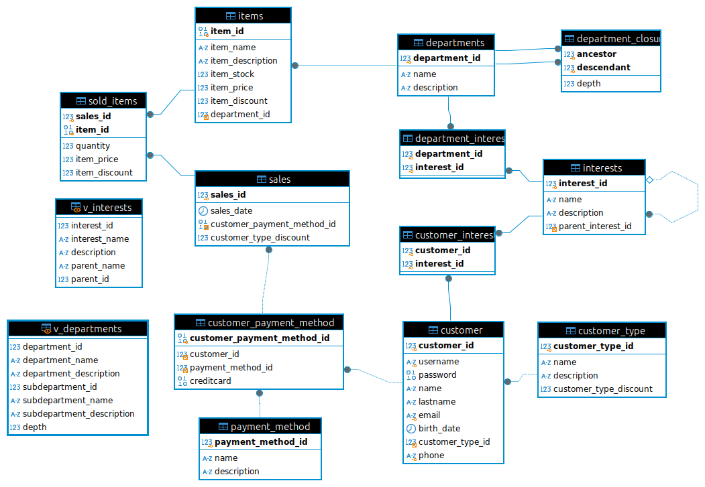

# CREACION DE Base de datos

## "miChangarro" TIENDA DEPARTAMENTAL. 

## Segunda Entrega.

El archivo de la primera entrega: [click aquí](../primera_entrega/readme.md).
 
Correcciones Primera Entrega : [Click aquí](./correcciones.md).

## Procedimiento para probar los objetos:  
 1. Correr el script [miChangarro.sql](./scripts/miChangarro.sql)
 2. Cargar los datos que se encuntran en la carpeta csv.

 | Tabla | Archivo |
 |----------|----------|
 | departments | [departments.csv](./csv/departments.csv) |
 | departments_closure |  [departments_closure.csv](./csv/departments_closure.csv) |
 | interests | [interests.csv](./csv/interests.csv) |

## Se crearon los siguientes Objetos:

	- v_interests (vista posibles intereses cliente)
	- v_departments (vista de departamantos) 
	- fn_check_interest_cycle
	- tr_check_interest_before_insert
	- tr_check_interest_before_update
	- sp_GetDepartmentByName
	- sp_GetDepartmentById	
	- sp_GetDepartmentBranchById
Y este sp para pruebas: 

	- sp_test_cycle_simulation	
	
# Pruebas: 
Esta información se encuentra en el archivo [segunda_entrega/scripts/test.sql](./scripts/test.sql)

**vistas**:
 
    - SELECT * FROM v_interests
    - SELECT * FROM v_departments
    
La **función**:

    - fn_check_interest_cycle
	
Se prueba con:

	call sp_test_cycle_simulation(1);
	
La función anterior verifica que no exista un loop al insertar o actualizar la tabla intereses(modelo lista adjacente) Un loop puede generarse si se tiene como padre a sí mismo o si tiene como padre a un hijo.

Estos son los id's con los que (1) Electrónica podría tener un loop. (el mismo y sus hijos).

| interest_id | name |
|------------- |------------- |
|1 | Electrónica |
| 14 | Televisores y Audio |
| 15 | Tecnología Móvil |

Los **triggers**:

	- tr_check_interest_before_insert
	- tr_check_interests_before_update
	

Verifican que no exista un loop con la función que ya probamos.

```
-- tr_check_interests_before_update:

-- Cambiamos Ropa de niño a Electrónica
UPDATE interests
SET parent_interest_id = 1 --Electrónica
WHERE interest_id = 18; -- Ropa de niño

-- Ahora crearemos un ciclo 
-- (Ropa Hombre no puede ser padre de Ropa)
UPDATE interests
SET parent_interest_id = 16 --Ropa Hombre
WHERE interest_id = 2; -- Ropa

SHOW WARNINGS;
```

Ahora probamos los **sp's**:

Muestra departamentos por nombre; todos si se le envía NULL:

	call sp_GetDepartmentByName(NULL); 
	call sp_GetDepartmentByName('Electrónicos'); 

Muestra departamentos por id; muestra todos si se envia NULL:

	call sp_GetDepartmentById(NULL);	-- Todos
	call sp_GetDepartmentByid(1);		-- Electrónicos

Muestra la rama del id Correspondiente.
-- 1. Electrónicos es padre de Electrodomésticos, Tectnología movil, etc.

	call sp_GetDepartmentBranchById(1);

-- 2. Electrodomésticos a su vez es padre de cocinas, Regrigeradores, etc.

	call sp_GetDepartmentBranchById(2);


El diagrama de la BD queda: 

